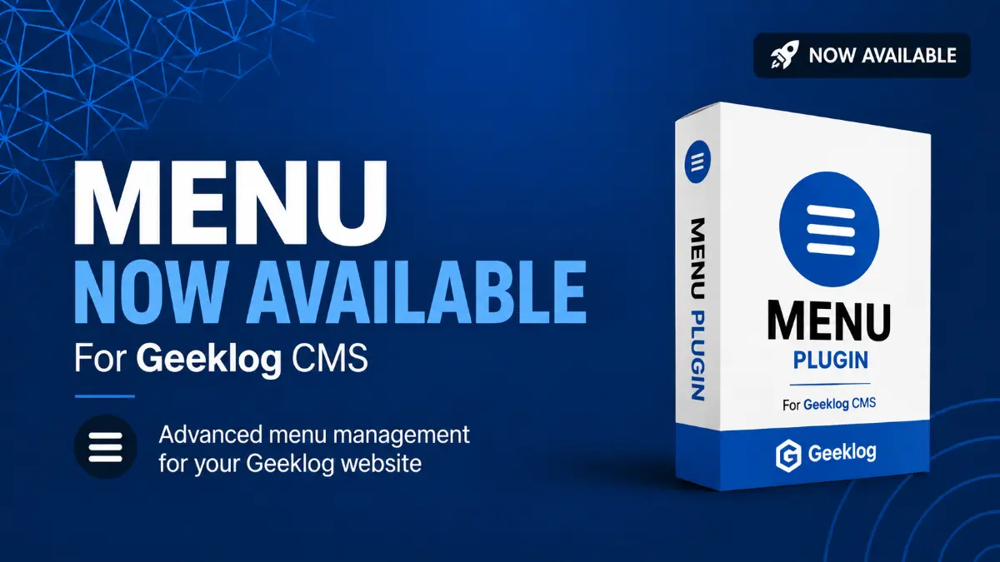

# Menu Plugin for Geeklog

Menu is a navigation management plugin for the [Geeklog CMS](https://www.geeklog.net/).

It lets administrators build reusable hierarchical navigation for headers, footers, blocks and content areas while preserving compatibility with existing Geeklog sites and exposing cleaner structural APIs for modern themes.

> Development repository: https://github.com/hostellerie/menu  
> Current development branch: `modernize-1.4.0`

## Menu 1.4.0 development line

Menu 1.4.0 builds on the compatibility and modernization work completed for 1.3.0. The current branch focuses on safer administration, clearer separation of responsibilities, stronger localization, improved theme integration, more predictable frontend asset loading and a more reliable development/release workflow.

### Compatibility target

- Geeklog **2.1.1 through 2.2.2**
- PHP **5.6 through 8.1**
- MySQL / MariaDB
- single-site and multisite installations
- upgrades from legacy Menu installations supported by the 1.3.0 migration path

The goal remains one shared codebase across the supported Geeklog and PHP range.

## Main features

- create horizontal, vertical and footer navigation menus;
- build hierarchical menus and submenus;
- reorder menu items from administration;
- control menu visibility and permissions;
- use Geeklog destinations such as topics, static pages, Geeklog actions and plugin-provided links;
- add menus to content with the `[menu:]` autotag;
- customize retained legacy rendering with colors, images and CSS;
- preview native and theme-provided rendering from administration;
- expose a presentation-neutral resolved tree for modern themes;
- retain the legacy rendering path for existing sites and themes;
- support runtime and filesystem-backed cache helpers;
- support multisite-safe plugin storage.

## 1.4.0 modernization already present

### Safer administration

The administration code has been split into smaller responsibilities instead of concentrating view generation, validation and mutations in one legacy file. The current branch includes dedicated modules for:

- menu views;
- menu mutations;
- element views;
- element validation;
- administration security;
- image upload handling;
- configuration validation.

Administration actions use Geeklog security and CSRF helpers, validate incoming values and escape stored/user-controlled text before rendering.

The admin wrapper now follows progressive enhancement: menu administration content remains visible even if optional JavaScript fails to load.

### Element handling and validation

Menu element creation/editing has been progressively normalized around explicit element types and dedicated validation. Supported legacy destination families remain available while the code moves away from loosely handled request values.

The current branch contains dedicated element-type and editor runtime helpers so type-specific behavior can evolve without duplicating large blocks of administration code.

### Theme and resolved-tree integration

Modern themes can consume Menu's resolved structural data and provide their own HTML, CSS and JavaScript. Menu keeps responsibility for hierarchy, destination resolution, permissions and ordering while themes remain responsible for presentation when they explicitly declare ownership of that menu's presentation.

Legacy rendering remains available for existing themes and for Menu autotags embedded inside theme areas such as headers, footers or content. In those cases the plugin keeps ownership of its generated presentation, including configured text and hover colors.

This distinction matters for integrations such as Eclipse: embedding `[menu:footer]` inside a theme footer does not by itself transfer presentation ownership to the theme. The colors selected in Menu remain authoritative for that menu.

This is the preferred direction for integrations such as the Eclipse theme and for future contextual or external consumers.

### Demand-loaded frontend assets

Menu now keeps a request-scoped registry of menus that reach `MENU_getMenu()`. On Geeklog's modern document renderer, legacy CSS and SlickNav resources are considered only for menus registered during the current request, with a compatibility fallback for canonical navigation/footer resources when the registry is still empty during early header generation.

Examples on Geeklog 2.2.2:

- `[menu:footer]` loads the footer menu CSS only;
- `[menu:footer]` does not load SlickNav because a simple footer menu does not need it;
- `[menu:footer] [menu:secondary]` loads resources for those two menus only once usage is known;
- an active vertical or horizontal menu that is not rendered contributes no Menu CSS or JavaScript once the request registry is populated;
- `load_legacy_css = false`, `load_legacy_js = false`, `legacy_rendering = false` and theme-owned presentation remain authoritative.

`plugin_templatesetvars_menu()` no longer renders both historical theme menus unconditionally. It checks the active theme source for `header_navigation` and `menu_footer`. Geeklog 2.2.2 uses the single `index.thtml` document renderer, so a referenced footer menu is prepared during the header phase, before resources are finalized.

Geeklog 2.1.1 has a different lifecycle: `COM_siteHeader()` finalizes the head before arbitrary page content and its autotags can call `MENU_getMenu()`. Because late CSS cannot be safely added to the already finalized head, Menu deliberately retains the historical active-menu resource fallback on 2.1.1. This preserves `[menu:...]`, direct `MENU_getMenu()` calls and legacy themes rather than introducing missing styles. The code detects the modern capability through `COM_createHTMLDocument()` instead of maintaining separate source trees.

The 2.1.1 template path still avoids unnecessary work where it is safe: `header.thtml` and `footer.thtml` are checked before historical template variables are populated, and `menu_footer` can be pre-registered before header finalization when the legacy footer template actually references it.

### Menu colors inside theme footers

Horizontal simple menus now keep their configured normal/visited/active and hover/focus colors even when rendered inside a footer whose theme CSS uses more specific selectors such as `#footer a:link`.

The plugin does not replace Menu's configured colors with theme colors. Instead, the generated Menu CSS keeps the values selected in the Menu administration interface authoritative for that menu.

### Localization

English is the canonical language contract for the plugin. Runtime language loading starts with English and overlays the selected translation so missing translated keys fall back safely instead of raising undefined-key warnings.

The branch includes a language-contract test that checks code references against the canonical English language file. French localization has also been extended for the modernized administration interface.

User-facing interface strings should be defined in language files rather than hardcoded in PHP or templates.

### Menu configuration and legacy color compatibility

The menu configuration page has been hardened for historical configuration values. A dedicated `color_utils.php` helper provides robust RGB conversion for legacy CSS color values and safely accepts `#RRGGBB`, `RRGGBB`, `#RGB` and `RGB` forms as well as empty, `none` or malformed historical values.

This keeps older stored menu configuration renderable on modern PHP versions without relying on temporary debugging code.

### Caching and runtime structure

The modernization work includes separate runtime/configuration and cache helpers, including runtime and filesystem cache layers. Cache remains disposable and separate from persistent menu data.

Generated per-menu CSS cache keys are versioned by menu id, active theme and a presentation-template fingerprint. Conceptually the key is now:

`menu_css_<menu_id>__<theme>__<presentation-fingerprint>`

The fingerprint is derived from Menu's presentation templates. When one of those templates changes, the cache key changes automatically and stale generated CSS is not reused. This is independent of the regular Geeklog cache-clear operation and prevents an updated plugin template from continuing to serve an older generated CSS payload.

### Multisite support

Plugin-owned private data uses site-specific Geeklog paths where appropriate. Migration logic is conservative: legacy data is preserved and migration routines are designed to be repeatable and non-destructive.

Shared-code multisite installations can therefore upgrade individual Geeklog sites without intentionally overwriting another site's plugin-owned data.

## Installation and upgrade testing

Install the plugin through Geeklog's standard plugin upload/administration interface.

After installation, open:

`Admin → Plugins → Menu`

During 1.4.0 development, the generated installable ZIP is also used for real upgrade tests. This is important because release validation must cover the actual archive layout and installer path, not only a checked-out source tree.

Always back up the database and site files before upgrading a production installation.

## Build and CI

The branch contains two permanent GitHub Actions workflows:

- **Menu CI** for compatibility/security/test checks;
- **Build installable archive** for producing `menu-1.4.0.zip`.

The CI matrix runs the PHP-compatible test suite on PHP 5.6 and PHP 8.1. Demand-loading tests cover modern request registration, canonical late-render fallback, footer/navigation combinations, unused menus, theme-owned presentation, legacy configuration switches, Geeklog 2.1.1 lifecycle fallback and Geeklog 2.2.2 template detection.

The build validates the language contract, creates the Geeklog installable archive, verifies the ZIP and publishes it as a downloadable GitHub Actions artifact. The generated archive is also committed under `dist/` for branch testing and is regenerated automatically when release-source files change.

Temporary debugging/patch workflows are not part of the retained development workflow.

## Release notes

See [`RELEASE_NOTES_1.4.0.md`](RELEASE_NOTES_1.4.0.md) for the 1.4.0 changes and upgrade notes.

## Development principles

- preserve Geeklog 2.1.1 → 2.2.2 compatibility unless the policy is explicitly changed;
- preserve PHP 5.6 → 8.1 compatibility while that remains the declared target;
- prefer small compatibility helpers over separate old/new source trees;
- keep upgrades non-destructive and idempotent;
- keep menu structure separate from theme presentation;
- keep user-facing text in language files;
- validate changes through the generated installable ZIP before release.

## Roadmap

See [`ROADMAP.md`](ROADMAP.md) for completed 1.4.0 foundations, remaining release work and longer-term capabilities such as destination diagnostics, active state, JSON portability, multilingual menu resolution, contextual menus and external APIs.

## Bugs and feature requests

Use the repository issue tracker:

https://github.com/hostellerie/menu/issues

When reporting a problem, include the Geeklog version, PHP version, database server/version, Menu version or commit/build used, and relevant Geeklog/PHP error output.

## Contributing

Contributions, test reports and documentation improvements are welcome.

1. Create a dedicated branch for the change.
2. Keep compatibility with the declared support range unless the roadmap explicitly changes it.
3. Keep interface text localizable.
4. Add or update tests when behavior changes.
5. Test the generated installable archive on the relevant Geeklog versions.
6. Open a pull request describing the problem, the implementation and validation performed.

## License

Menu is free software distributed under the GNU General Public License, version 2 or, at your option, any later version.
